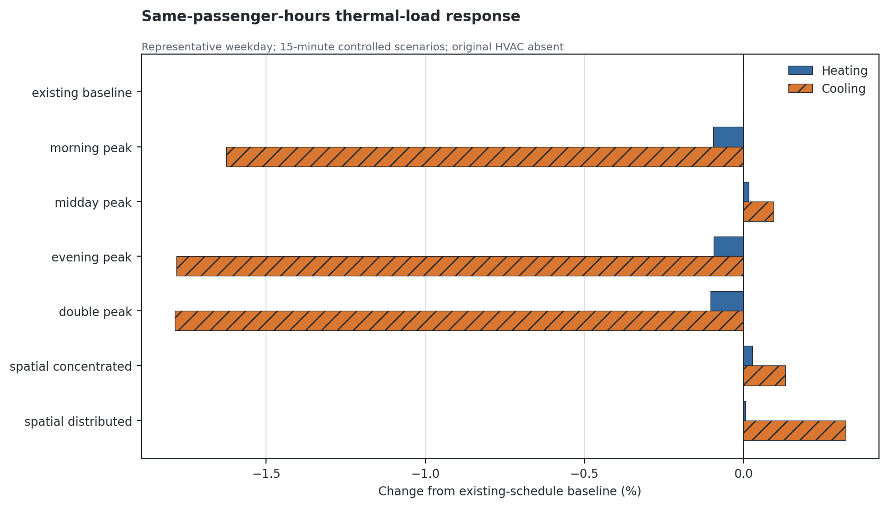
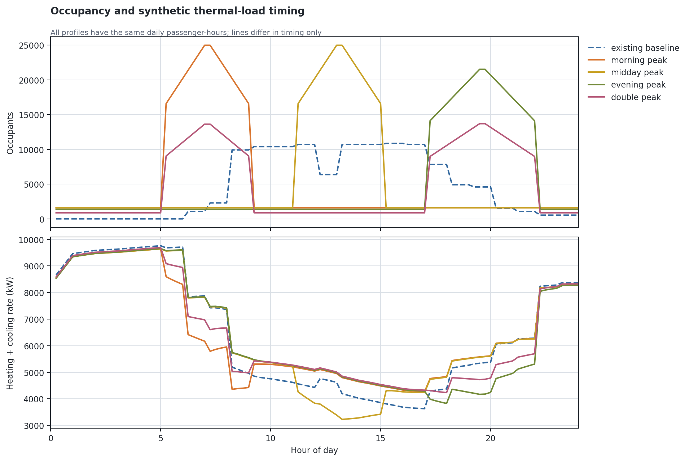
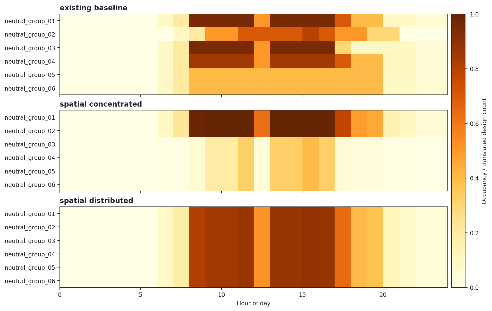

# Controlled Airport Occupancy Scenario Results

## Technical summary

**Final occupancy decision: `OCCUPANCY_DEMO_ONLY`.** 20/20 baseline/scenario simulations passed the controlled one-day execution gate. All temporal and spatial comparisons preserved the representative weekday reference of **115,063.232 passenger-hours**; the largest compiled absolute conservation error was **1.03028e-07 passenger-hours**, and the largest EnergyPlus-output minus compiled discrepancy was **1.45519e-11 passenger-hours**.

The largest same-passenger-hours change in daily synthetic heating plus cooling energy was `double_peak__spatial_distributed` at **-0.15%** relative to the existing-schedule baseline. This is a deterministic controlled response, not evidence of real terminal HVAC electricity or a passenger forecast.

The model has no original AirLoop, PlantLoop, or real zone HVAC equipment. Therefore the evidence supports an IDF-native compiler and synthetic thermal-load demo only; it cannot satisfy the real-HVAC or annual-baseline gates for a paper case.

## Same passenger-hours produces different timing and synthetic load

The signed bar comparison keeps the daily denominator fixed and reports each heating/cooling change relative to its own baseline. Differences therefore arise from timing/spatial allocation and their interaction with envelope, setpoints, outdoor conditions, and Ideal Loads—not from changing the total passenger-hours.

| Scenario | Kind | Passenger-hours | Heat kWh | Cool kWh | Total thermal delta | Heat peak kW | Cool peak kW |
|---|---|---:|---:|---:|---:|---:|---:|
| `existing_baseline` | existing_baseline | 115,063.232 | 151,563.998 | 4,027.614 | +0.00% | 9,758.327 | 670.393 |
| `morning_peak` | temporal_redistribution | 115,063.232 | 151,420.647 | 3,962.153 | -0.13% | 9,640.407 | 660.552 |
| `midday_peak` | temporal_redistribution | 115,063.232 | 151,589.762 | 4,031.425 | +0.02% | 9,639.608 | 679.228 |
| `evening_peak` | temporal_redistribution | 115,063.232 | 151,421.315 | 3,955.830 | -0.14% | 9,653.175 | 660.218 |
| `double_peak` | temporal_redistribution | 115,063.232 | 151,407.828 | 3,955.625 | -0.15% | 9,692.126 | 659.752 |
| `spatial_concentrated` | spatial_redistribution | 115,063.232 | 151,605.868 | 4,032.899 | +0.03% | 9,758.318 | 671.061 |
| `spatial_distributed` | spatial_redistribution | 115,063.232 | 151,572.796 | 4,040.520 | +0.01% | 9,758.305 | 671.868 |
| `morning_peak__spatial_concentrated` | spatiotemporal_redistribution | 115,063.232 | 151,456.125 | 3,963.746 | -0.11% | 9,640.936 | 660.686 |
| `morning_peak__spatial_distributed` | spatiotemporal_redistribution | 115,063.232 | 151,412.826 | 3,967.101 | -0.14% | 9,640.185 | 660.871 |
| `midday_peak__spatial_concentrated` | spatiotemporal_redistribution | 115,063.232 | 151,645.933 | 4,040.535 | +0.06% | 9,640.117 | 680.823 |
| `midday_peak__spatial_distributed` | spatiotemporal_redistribution | 115,063.232 | 151,599.823 | 4,048.360 | +0.04% | 9,639.378 | 682.836 |
| `evening_peak__spatial_concentrated` | spatiotemporal_redistribution | 115,063.232 | 151,461.178 | 3,955.037 | -0.11% | 9,653.616 | 660.325 |
| `evening_peak__spatial_distributed` | spatiotemporal_redistribution | 115,063.232 | 151,420.821 | 3,958.907 | -0.14% | 9,652.908 | 660.484 |
| `double_peak__spatial_concentrated` | spatiotemporal_redistribution | 115,063.232 | 151,441.521 | 3,953.709 | -0.13% | 9,692.417 | 659.823 |
| `double_peak__spatial_distributed` | spatiotemporal_redistribution | 115,063.232 | 151,401.461 | 3,957.153 | -0.15% | 9,691.973 | 659.926 |

## Temporal redistribution shifts occupancy and load peaks

The paired time series shows the exact 96-point occupant trajectory and the aggregate synthetic heating-plus-cooling rate. Peak coincidence, not just the daily integral, explains why equal passenger-hours can produce different thermal-load totals and peaks.

| Temporal scenario | Occupant peak | Occupant peak time | Heat peak kW | Heat peak time | Heat peak delta | Cool peak kW | Cool peak time | Cool peak delta |
|---|---:|---|---:|---|---:|---:|---|---:|
| `existing_baseline` | 10,860.515 | 01/18  16:00:00 | 9,758.327 | 01/18  05:00:00 | +0.00% | 670.393 | 01/18  14:30:00 | +0.00% |
| `morning_peak` | 24,970.319 | 01/18  07:15:00 | 9,640.407 | 01/18  05:00:00 | -1.21% | 660.552 | 01/18  14:30:00 | -1.47% |
| `midday_peak` | 24,970.319 | 01/18  13:15:00 | 9,639.608 | 01/18  05:00:00 | -1.22% | 679.228 | 01/18  14:30:00 | +1.32% |
| `evening_peak` | 21,505.866 | 01/18  19:45:00 | 9,653.175 | 01/18  05:00:00 | -1.08% | 660.218 | 01/18  14:30:00 | -1.52% |
| `double_peak` | 13,685.551 | 01/18  19:45:00 | 9,692.126 | 01/18  05:00:00 | -0.68% | 659.752 | 01/18  14:30:00 | -1.59% |

Occupant peaks move to the prescribed windows, but the aggregate heating peak remains at 05:00 and the cooling peak at 14:30 in every temporal case. The weather/envelope-dominated system peak does not follow the occupant peak; only its magnitude changes (about −1.22% to −0.68% for heating and −1.59% to +1.32% for cooling). This weak coupling reinforces the demo-only decision.

## Spatial effects are neutral-group experiments, not inferred terminal functions

The six translated People/SpaceList groups are shown only as neutral groups. The concentrated vector weights the two largest groups and uses a bounded spillover allocator; the distributed vector equalizes occupancy fraction relative to each group's translated design count. No object name is used to invent check-in, security, gate, baggage, or arrivals labels. The heatmap uses occupant count divided by each group's translated design count so the redistribution is visible without letting the largest group dominate the scale.

## Volume sensitivity is a separate commonplace control

These rows intentionally change passenger-hours. They check numerical and mechanism monotonicity but are not used as evidence for distribution novelty.

| Scenario | Passenger-hours | Total thermal kWh | Delta vs baseline | Heat peak kW | Cool peak kW |
|---|---:|---:|---:|---:|---:|
| `volume_0_50` | 57,531.616 | 159,729.975 | +2.66% | 9,759.629 | 664.557 |
| `volume_0_75` | 86,297.424 | 157,659.078 | +1.33% | 9,758.980 | 667.471 |
| `volume_1_00` | 115,063.232 | 155,591.612 | +0.00% | 9,758.327 | 670.393 |
| `volume_1_25` | 143,829.040 | 153,529.809 | -1.33% | 9,757.681 | 673.325 |
| `volume_1_50` | 172,594.848 | 151,466.896 | -2.65% | 9,756.986 | 676.269 |

On this winter day, increasing occupancy from 0.50× to 1.50× raises People heat gains and cooling energy but displaces more heating energy, so total synthetic heating-plus-cooling energy decreases. This is a thermal-balance control result, not a novel passenger-flow finding and not a general annual energy relationship.

## Scope, data, and metric definitions

- Model cohort: one zoned candidate with 29 source People instances, translated into 6 People groups serving 304 Zones.
- Baseline window: controlled Wednesday, month 1, day 18; 96 15-minute timesteps.
- Passenger-hours: sum of Zone People Occupant Count multiplied by 0.25 h.
- Daily synthetic load energy: sum of exact RDD-confirmed Zone Ideal Loads Supply Air Total Heating/Cooling Energy, converted from J to kWh.
- Peak load: the maximum synchronized sum of zone heating or cooling rate; individual-zone maxima are not added across different times.
- Spatial heterogeneity: mean timestep coefficient of variation across Zone People Occupant Count outputs.

## Experimental method and reproducibility

The baseline profiles are resolved from exact EnergyPlus `Schedule Value` and occupant-count outputs; unrounded design populations are recovered from their positive-timestep ratios, while EIO is used for expanded-zone counts. They are not guessed from office schedule syntax. The compiler replaces only each People `Number of People Schedule Name`, emits a 365×96 deterministic `Schedule:File`, verifies passenger-hours from emitted 12-decimal values, and runs an IDD-bound representative weekday. People→Zone and Zone→HVAC relations reuse the frozen semantic representation through an analysis adapter; the repair method and Final100 are untouched.

Runtime: `EnergyPlus, Version 23.1.0-87ed9199d4`; runtime SHA-256 `9832298eb181205db921b2c3d40dc2e89f12793c963e0f3177e1fd7bd8534382`; IDD SHA-256 `d171e0583cd43c8c0abe39a5ffcf95d7100f4ec6809c887963e25c9cbcfe1df3`; weather SHA-256 `c5a000246fd9c838eefeea8ddaa808bc1ed349ea33ced3f620f24f8ccebd2a3e`.

## Mechanism interpretation and unavailable outputs

People sensible, latent, and radiant gains and synthetic Ideal Loads heating/cooling are observable. Ideal Loads outdoor-air terms are reported separately when available. Original fan, pump, coil, AirLoop, DCV, and real terminal HVAC electricity remain unavailable—not zero—because the source model contains no corresponding system. Facility electricity from this derivative must not be relabeled as original terminal HVAC energy.

| Scenario | People sensible kWh | People latent kWh | People radiant kWh | Ideal Loads OA heat kWh | OA mass-flow peak kg/s |
|---|---:|---:|---:|---:|---:|
| `existing_baseline` | 9,975.904 | 3,996.806 | 2,992.771 | 122,590.714 | 170.466 |
| `morning_peak` | 9,996.600 | 3,976.110 | 2,998.980 | 122,695.098 | 170.466 |
| `midday_peak` | 9,974.686 | 3,998.024 | 2,992.406 | 122,496.398 | 170.466 |
| `evening_peak` | 9,991.603 | 3,981.106 | 2,997.481 | 122,660.840 | 170.466 |
| `spatial_concentrated` | 9,950.291 | 3,908.351 | 2,985.087 | 122,584.766 | 170.466 |
| `spatial_distributed` | 9,979.728 | 4,031.257 | 2,993.918 | 122,600.517 | 170.466 |
| `volume_0_50` | 4,988.190 | 1,998.165 | 1,496.457 | 122,624.235 | 170.466 |
| `volume_1_50` | 14,962.871 | 5,996.194 | 4,488.861 | 122,560.219 | 170.466 |

The outdoor-air mass-flow peak is invariant at **170.466–170.466 kg/s** across all runs. This confirms that the derivative's blank demand-controlled-ventilation field does not make ventilation flow responsive to current People count. Observed load differences are therefore dominated by internal gains and zone thermal timing; they are not evidence of occupancy-driven DCV/fan response.

## Limitations, robustness, and admission boundary

- The input is user-authored and provenance is clear, but the raw OSM is not publicly distributed; public reproducibility covers the compiler/tests and aggregate evidence, not independent rerunning of this private geometry.
- Source occupancy schedules are generic office/retail archetypes, not flight or passenger-flow observations. The experiment is controlled, not predictive.
- The run is a representative weekday, not a stable annual real-HVAC baseline.
- Added Ideal Loads equipment establishes thermal-load mechanics only. It does not establish fan, pump, coil, DCV, or controls response.
- Deterministic single runs support exact comparisons; no statistical significance or population generalization is claimed.

## Recommended next step

Keep the extension as a GitHub/demo result. Do not add it to the main Energy and Buildings results unless a provenance-clear terminal model with real HVAC, a stable annual baseline, and occupancy-linked ventilation/control becomes available. Manuscript drafting for the frozen semantic-repair contribution can proceed now.

## Further questions

A future case would need explicit terminal-function group labels, operational or flight-bank data, real AirLoop/PlantLoop/zone HVAC, and annual calibration. Only then could the same compiler test whether temporal/spatial redistribution changes fan, coil, outdoor-air, or control energy in a real system.
