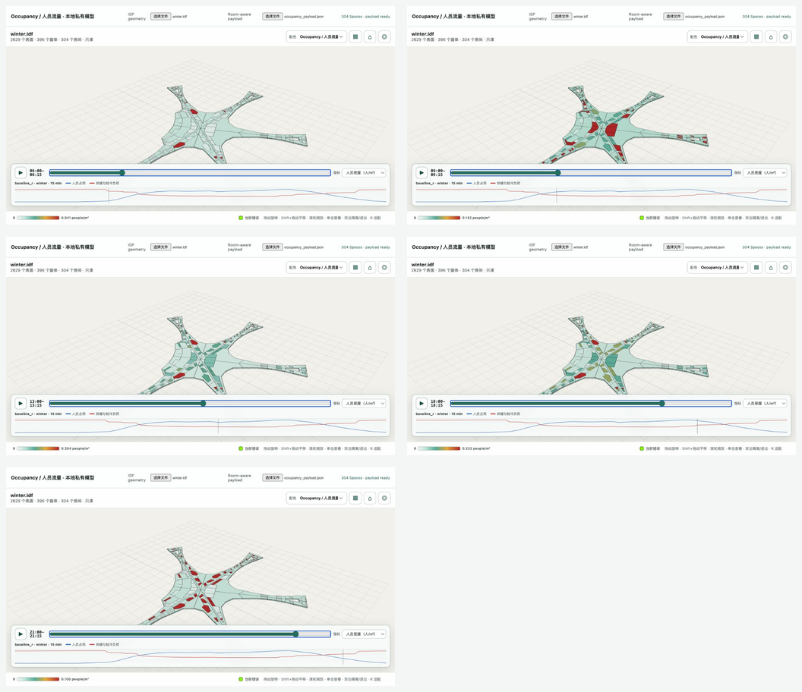
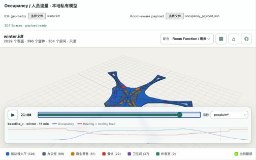
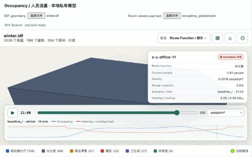

# Room-aware 3D visualization validation

**Status:** `PASS`
**Payload SHA-256:** `530ef9d510ba3b87ab1624efb59b49d14a4f4daa2d7208d0241176fa13b2feb6`
**Scenario:** `baseline_r` / `winter` / 15 minutes

The generic viewer shared by the original IDFRepair Demo and the private validation
harness maps 304 payload Space keys to 304 source geometry rooms. Orphan zone
`xbrestroom2` is excluded because it has no Space. Room Function View uses six fixed
category colors; Occupancy View uses one continuous people/m² colormap and can switch
to occupant count or percent of Baseline R design capacity.

| Displayed interval | EnergyPlus interval-end timestamp | Index | People | Heating kWₜₕ | Cooling kWₜₕ | Max density people/m² |
| --- | --- | --- | --- | --- | --- | --- |
| 06:00–06:15 | 01/15  06:15:00 | 24 | 863.606 | 8,575.924 | 0.000 | 0.0225 |
| 09:00–09:15 | 01/15  09:15:00 | 36 | 7,773.371 | 5,498.637 | 9.031 | 0.1417 |
| 13:00–13:15 | 01/15  13:15:00 | 52 | 8,054.727 | 4,571.355 | 222.479 | 0.3280 |
| 18:00–18:15 | 01/15  18:15:00 | 72 | 9,324.123 | 6,114.102 | 0.000 | 0.2020 |
| 21:00–21:15 | 01/15  21:15:00 | 84 | 4,610.491 | 7,427.514 | 0.000 | 0.1945 |

## Acceptance checks

- 304/304 Spaces categorized and mapped; zero unknowns.
- Legend: hall 126, office 69, commerce 51, dining 22, restroom 27, breakroom 9.
- One metadata conflict remains visible in the Space detail card.
- Every Space has 96 occupancy, heating and cooling values reconciled to EnergyPlus CSV.
- `z-u-hall-2` and `z-u-hall-3` are visible entrance seeds; public rooms use 0/15/30/45-minute controlled occupancy-response phases derived from the source Zone adjacency graph. These are not claimed as walking times.
- Slider indices 24/36/52/72/84 resolve to intervals beginning at
  06:00/09:00/13:00/18:00/21:00. The visible label is start–end (for example,
  06:00–06:15), while the linked EnergyPlus timestamp is the interval end (06:15).
- Browser QA passed Room Function/Occupancy modes, three metrics, scrub, play/pause,
  chart click/drag, play/pause, Space isolation, entrance/phase metadata and conflict badge; page console warnings/errors = 0, dialogs = 0.
- Original-Demo integration QA passed local JSON load and clear-layer behavior. The
  load/clear controls sit beside `Settings and required files`; idle and successful
  payload states consume no extra status line. Clearing occupancy leaves the loaded
  read-only IDF geometry in place; changing the IDF clears the optional payload so a
  stale room mapping cannot be reused.
- Narrow-view QA after the loader fix: `scrollWidth == innerWidth`.

The viewer loads local derivative IDF and JSON files. Raw OSM and derived private model
files are excluded from public distribution.
